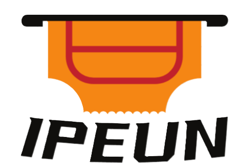

# Event Management System dengan menggunakan Laravel 5.8



# About IPEUN

Untuk capstone project yang kami dapat dari mitra GAMELAB.ID, kami diminta untuk membuat sebuah website dengan tema “Event Management System”. Dengan tema yang sudah diberikan, kami sepakat untuk membuat website penjualan tiket konser musik yang Bernama “IPEUN”.

## Installation

Clone project

```bash
  git clone https://github.com/17Rivaldi/IPEUN.git
```

Buka direktori project yang sudah di clone

```bash
  cd IPEUN
```

Jalankan perintah ini pada terminal project

```bash
  composer Install
```

```bash
  npm install
```

```bash
  npm run dev
```

Lakukan Migrasi Database

```bash
  php artisan migrate
```

```bash
  php artisan db:seed
```

## Login Sebagai

-   Admin Account
    `admin@role.id` - Full Akses

-   Organizer Account
    `organizer@role.id` - Akses Dashboard Organizer

-   User Account
    `user@role.id`

untuk **Password** semuanya sama -> **12345678**

## Contributing

Terima kasih telah berkontribusi dalam pembuatan web IPEUN ini

-   ANISA RACHMADANI HENDRIAN
-   ALFAN FARHAN HADI
-   IIN MAHARANI AKBAR
-   RIVALDI SYAPUTRA
-   YUDISTHIRA ILHAM
